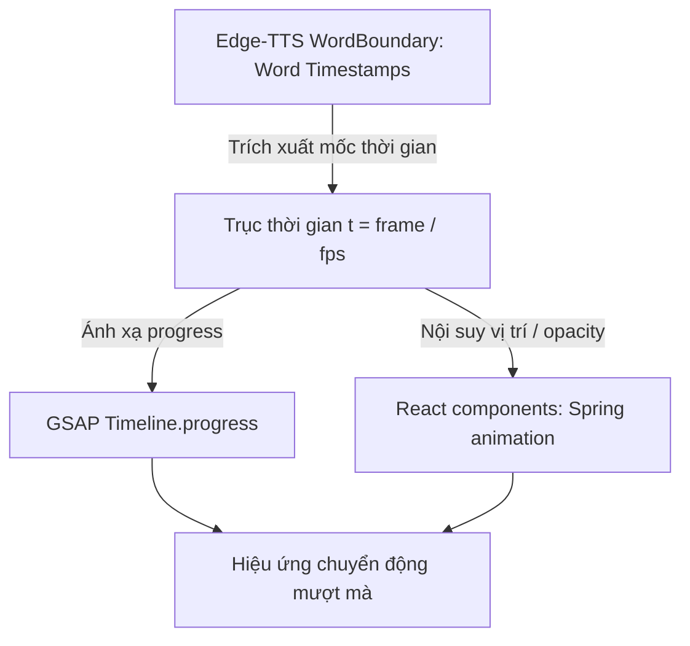
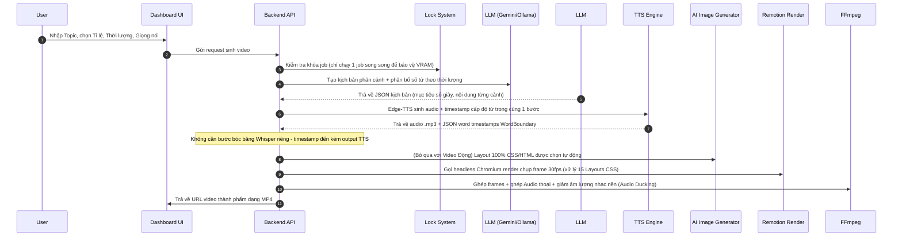

# TÀI LIỆU ĐẶC TẢ YÊU CẦU PHẦN MỀM (SRS) - PHẦN 2

## 3. Kiến trúc Hệ thống & Thiết kế Tính năng Cốt lõi

### 3.1 Mô hình Trạng thái Động (State-driven Animation)
Để giải quyết triệt để bài toán "nói đến đâu hình chạy đến đó", hệ thống không dựng video tĩnh mà dùng mô hình nội suy thời gian thực:
* Trục thời gian liên tục được tính:
  \[t = \frac{\text{currentFrame}}{\text{fps}}\]
* Dựa trên mốc thời gian thực tế của từng từ bóc tách bởi Whisper, Remotion sẽ tính toán giá trị `spring` hoặc `interpolate` để dịch chuyển các phần tử đồ họa (như biểu đồ, mũi tên, hình ảnh) chính xác theo tiếng nói.
* **Đồng bộ hóa GSAP (GreenSock)**: Vì GSAP chạy theo thời gian thực (time-based) còn Remotion chạy theo frame-by-frame, hệ thống sẽ đồng bộ hóa bằng cách điều khiển tiến trình của GSAP timeline thủ công thông qua frame hiện tại:
  `gsapTimeline.progress(frame / durationInFrames)`
  Cách tiếp cận này ngăn chặn hiện tượng giật, trượt hình hoặc mất đồng bộ âm thanh khi xuất video 30fps.

### 3.2 Chiến lược Chống khung hình chết (Anti-Dead-Frame)
Để video luôn sinh động kể cả khi slide không thay đổi nội dung:
1. **Dynamic Background (Lớp nền động)**: Sử dụng hiệu ứng chuyển động nhiễu hạt nhẹ (noise) hoặc chuyển màu gradient chậm bằng mã CSS để màn hình luôn có sự sống.
2. **Virtual Camera (Camera ảo)**: Áp dụng các hàm nội suy tự động phóng to/thu nhỏ nhẹ (pan/zoom từ 1% đến 2%) xuyên suốt chiều dài của slide để tạo cảm giác điện ảnh sống động.

### 3.3 Hệ sinh thái Layout Động (Dynamic Layout Ecosystem)
Để video tạo ra luôn cuốn hút và không lặp lại nhàm chán (đặc biệt với độ dài 90s - 3 phút), hệ thống đã loại bỏ hoàn toàn các ảnh nền tĩnh (bitmap) và xây dựng bộ **15 Bố cục (Layouts) chuyển động 100% bằng HTML/CSS/GSAP**:
1. **15 biến thể giao diện cao cấp**: Bao gồm Card, Cream Minimal, Tech Manim, Title, List, Text-Image (với 3D CSS Mockup), Text-Video (giả lập UI radar), Chart (CSS Grid Bar), Bento Box, Split 3D Isometric, Quote, Stats Grid, Timeline, Code Snippet, và Outro.
2. **Thuật toán Thời lượng linh hoạt (Adaptive Timings)**: Mỗi layout có một cấu trúc hiển thị khác nhau. Do đó, hệ thống (frontend `layoutsTimings.ts` & backend `video.ts`) sử dụng thuật toán nội suy linh hoạt để tự động cộng dồn thời gian entrance + voice reading + exit phù hợp chính xác cho từng loại giao diện.

---

## 4. Luồng xử lý chi tiết (Data Pipelines)

### Pipeline 1: Sản xuất Video (Card Motion)

### Pipeline 2: Sản xuất Bài post Mạng xã hội (Image Post)
* Bỏ qua bước sinh âm thanh (TTS) và bóc băng (Whisper).
* LLM sinh nội dung tóm tắt theo các slide độc lập.
* Remotion sử dụng lệnh `renderStill` để chụp trực tiếp các slide tĩnh dưới dạng ảnh JPEG/PNG độ phân giải cao.
* Bộ ảnh sau khi chụp được gom lại và nén thành file `.zip` thông qua module Zip cục bộ (`zip.ts` dùng PowerShell `Compress-Archive`), trả về link tải trực tiếp cho người dùng.

### Pipeline 0 (phụ trợ): Xem trước Kịch bản nhanh (Script Preview)
* Endpoint `POST /api/script` sinh **JSON kịch bản** (card hoặc imagepost) **mà KHÔNG render** video/ảnh.
* Mục đích: cho người dùng duyệt/chỉnh nội dung trước khi chạy bước render tốn tài nguyên — nhanh hơn nhiều lần so với chạy full pipeline.

### Các biến thể Pipeline trong code
Backend hiện có **3 hàm pipeline**, cần phân biệt rõ:
1. **`runCardPipeline()` (Card Motion — CHÍNH cho Video):** Remotion render 100% layout CSS/GSAP, đồng bộ theo word timestamp.
2. **`runImagePostPipeline()` (Image Post — CHÍNH cho Bộ ảnh):** Remotion `renderStill` từng slide → nén ZIP.
3. **`runPipeline()` (legacy):** pipeline cũ ghép ảnh AI + hiệu ứng Ken Burns + nung phụ đề bằng FFmpeg. Giữ lại để tham chiếu, **không phải luồng chính**.

### Lựa chọn Nhạc nền (Background Music)
* Endpoint `GET /api/music` tự liệt kê các track nhạc trong `public/assets/music`.
* Track được chọn truyền vào `runCardPipeline()` qua tham số `bgMusic` và được **Audio Ducking** (giảm âm lượng khi có lời thoại) khi ghép bằng FFmpeg.

---

👉 Xem tiếp: [Kích thước, Yêu cầu Chức năng & UI/UX](./srs_3_requirements_ui.md)
